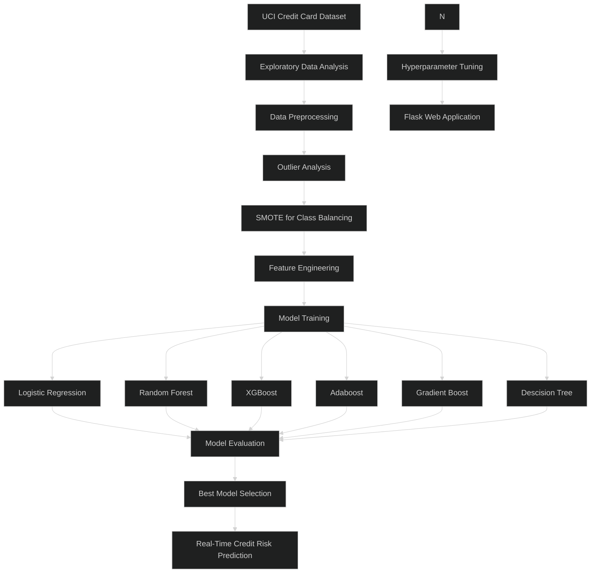
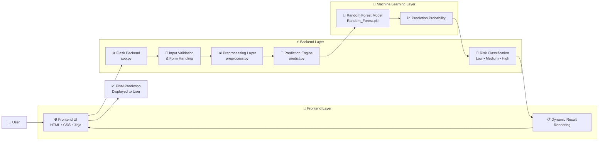

# CrediSENSE
### Machine Learning Powered Credit Default Risk Prediction System


---

## Overview

CrediSENSE is an end-to-end Machine Learning web application designed to predict the probability of credit card default based on customer demographic, financial, and repayment behavior.

The project combines:
- Exploratory Data Analysis (EDA)
- Data Preprocessing
- Machine Learning Model Training
- Hyperparameter Tuning
- Flask Backend Development
- Frontend Integration

to simulate a real-world AI-powered fintech solution.

---

## Problem Statement

Credit card defaults are one of the major financial risks faced by banks and financial institutions.

Traditional credit scoring systems often fail to capture complex behavioral patterns of customers, leading to delayed risk detection and financial losses.

The objective of this project is to build a Machine Learning system capable of predicting whether a customer is likely to default on their next payment using historical financial and repayment information.

### Business Objectives
- Identify high-risk customers early
- Reduce financial losses
- Improve credit risk assessment
- Support data-driven lending decisions

---

## Dataset Information

This project uses the **Default of Credit Card Clients Dataset** from the UCI Machine Learning Repository.

### Dataset Source
https://archive.ics.uci.edu/ml/datasets/default+of+credit+card+clients

### Dataset Details

| Attribute | Value |
|---|---|
| Total Records | 30,000 |
| Features | 23 |
| Target Variable | default payment next month |
| Problem Type | Binary Classification |

---

## Project Workflow



---

## System Architecture



---

## Machine Learning Models Used

- Logistic Regression
- Decision Tree
- Random Forest
- AdaBoost
- Gradient Boosting
- XGBoost

---

## Model Selection

After evaluation, the **Random Forest Classifier** was selected as the final deployed model.

### Why Random Forest?

The model achieved:
- Strong Recall Performance
- Better Generalization
- Stable Cross Validation Performance
- Reduced Overfitting

Since this is a financial risk prediction problem, recall was prioritized to minimize false negatives and avoid missing high-risk customers.

---

## Tech Stack

### Machine Learning
- Scikit-learn
- XGBoost
- Imbalanced-learn

### Data Analysis
- Pandas
- NumPy
- Matplotlib
- Seaborn

### Backend
- Flask

### Frontend
- HTML
- CSS
- Jinja2

---

## Project Structure

```text
RiskLens-AI/
│
├── app.py
│
├── models/
│   └── Random_Forest.pkl
│
├── src/
│   ├── config.py
│   ├── predict.py
│   ├── preprocess.py
│   └── utils.py
│
├── templates/
│   ├── base.html
│   ├── index.html
│   └── predict.html
│
├── static/
│   └── style.css
│
├── notebooks/
│   ├── eda.ipynb
│   ├── preprocessing.ipynb
│   ├── model_training.ipynb
│   └── evaluation.ipynb
│
└── requirements.txt
```

---

## Installation

```bash
git clone (https://github.com/pk03-codes/Credit-Card_Default_Prediction_model.git)
```

```bash
pip install -r requirements.txt
```

```bash
python app.py
```

---

## Future Improvements

- Docker Integration
- Explainable AI (SHAP)
- Deep Learning Models
- Interactive Dashboard
- LLM-powered Financial Insights

---

## Author

**Priyam Kumar De**

B.Tech Mathematics and Computing  
Machine Learning & AI Enthusiast
